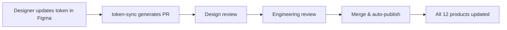

When you have 12 products, 4 engineering teams, and 3 design teams, **visual consistency isn't a nice-to-have — it's a prerequisite for shipping fast.** If every team picks their own gray, the brand dilutes. If every button component lives in its own repo, you spend more time auditing than building.

Our solution was a shared design token system, and here's how we built it.

## The Token Hierarchy

We use a three-tier token architecture:

### 1. Global tokens
Raw values that never change between themes or products:

```json
{
  "color-white": "#FFFFFF",
  "color-black": "#000000",
  "spacing-4": "4px",
  "spacing-8": "8px",
  "font-size-14": "14px",
  "font-size-16": "16px"
}
```

### 2. Alias tokens
Semantic names that map global tokens to roles. This is where the theme switching happens:

```json
{
  "color-surface-primary": "{color-white}",
  "color-surface-secondary": "{color-black}",
  "color-text-primary": "{color-black}",
  "color-border-default": "#D1D5DB"
}
```

### 3. Component tokens
Component-specific tokens that alias into the semantic layer:

```json
{
  "button-primary-bg": "{color-surface-primary}",
  "button-primary-text": "{color-text-primary}"
}
```

## Tooling

We built a small CLI (`token-sync`) that:

1. Reads the source JSON from a monorepo package
2. Validates every reference resolves (no dangling pointers)
3. Generates output formats: CSS custom properties, Tailwind config, and a Figma JSON plugin file

The Figma plugin lets designers inspect any component and see exactly which token maps to which layer. No more "this gray looks off" tickets.

## The Workflow

A design change flows like this:



The entire cycle takes about 4 hours from approval to production. Before tokens, the same change took 2-3 weeks of manual audits.

## Key Takeaway

Invest in tooling early. The token hierarchy is simple — the hard part is keeping the pipeline from design to production fast and automated. If your designers are waiting on engineers to wire up a color, your token system isn't finished yet.
